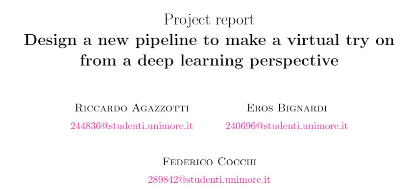

# vision project
Computer vision project 

 gruppo 16: per l'esame

 - Federico
 - Riccardo
 - Eros

 ## Title:
 ## Computer Vision for improving the Cloth E-Commerce experience

## Abstract:

Nowadays E-Commerce is very popular for big companies and people who want to sell
their products around the word. This way of trading has also been boosted thanks to
Covid-Pandemic. Our goal is to provide a platform to make the "Made in Italy" excel-
lencies easier to buy worldwide without losing product quality. In this project we want to
develop an application to improve the cloth trading. Thinking about this type of goods,
the main problem every costumer encounter is in guessing the right size and how the dress
would fit once received. The idea is to develop a pipeline to understand,from a picture,
what a person is wearing and what he/she would like to wear. The first step is retrieving
and classifying its clothes. The second step is to extract a feature vector from the clothes
and provide some recommendation on what he/she would like according to similar items
in our dataset. For the last step, the goal is to apply geometric transformations to our
recommended clothes pictures to fit them on our customer body to see how the product
fits.

